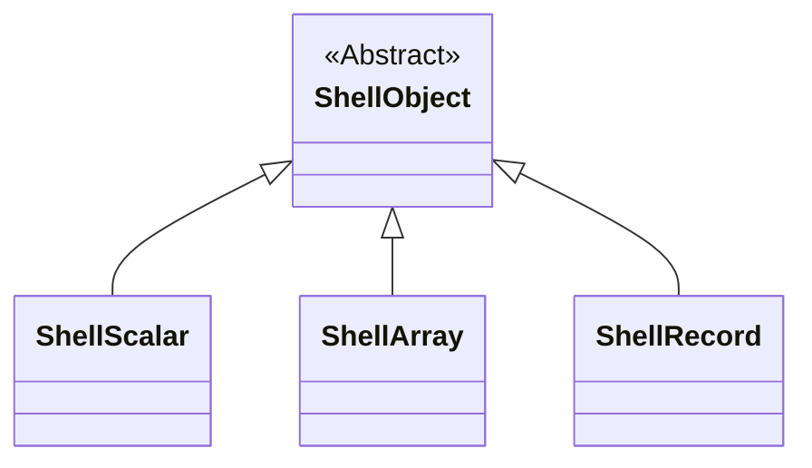
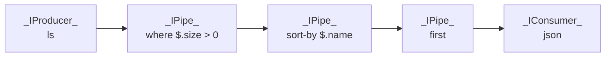

# cshell

A simple shell app inspired by LINQ. Use `|` to chain commands together.

```pwsh
ls | where $.size > 0 | sort-by $.size | table
```

| Name                      | Type | CreationTime        | LastWriteTime       | Size   |
|---------------------------|------|---------------------|---------------------|--------|
| CShell.runtimeconfig.json | file | 10/01/2024 18:28:55 | 10/01/2024 18:28:55 | 1496   |
| CShell.deps.json          | file | 10/01/2024 18:28:55 | 10/01/2024 18:28:55 | 3557   |
| Spectre.Console.Json.dll  | file | 10/01/2024 18:28:55 | 22/11/2023 13:31:48 | 37888  |
| CShell.pdb                | file | 16/01/2024 22:06:15 | 16/01/2024 22:06:15 | 41756  |
| CShell.dll                | file | 16/01/2024 22:06:15 | 16/01/2024 22:06:15 | 61952  |
| CShell.exe                | file | 16/01/2024 22:06:15 | 16/01/2024 22:06:15 | 140800 |
| CommandLine.dll           | file | 10/01/2024 18:28:55 | 17/05/2022 08:11:32 | 225280 |
| Spectre.Console.dll       | file | 10/01/2024 18:28:55 | 22/11/2023 13:31:48 | 709120 |

## Data Model


### ShellScalar
Represents a single value from the following list:
- Null
- Bool
- Int  
- Real
- Str
- Date

Use the command with the same name to generate scalars.

### ShellArray
Represents an array of `ShellObject`. Elements of the array can have different types.

```pwsh
array int 1 "2" 3
```
Results in an array with `[1, 2, 3]`.

### ShellRecord
Represents an associative array of key-value pairs, where the key is a string and the value is a `ShellObject`.

## Shell Pipeline
A command can be a producer, a consumer or a pipe.

- Producers (or sources) are commands that do not consume data from other commands but instead generate it from user input.

- Consumers (or sinks) are commands that only consume data from other commands and output to the console.

- Pipes are commands that are meant to be in between Producers and Consumers. They transform data.

A well formed pipeline must start with a Producer command, followed by 0 or more Pipe commands and terminating with an optional Consumer command. If not consumer command is specified, then `table` command is used.

For the above example
```pwsh
ls | where $.size > 0 | sort-by $.name | first | json
```

We would have the following flow:


- `ls`  
  List all system entries in the current directory.
- `where $.size > 0`  
  Take only entries with size greater than 0 bytes.
- `sort-by $.name`  
  Order entries by name.
- `first`  
  Take first entry.
- `json`  
  Output result as JSON.

## References
- [Command Line Parser](https://github.com/commandlineparser/commandline) for parsing commands.
- [Spectre.Console](https://spectreconsole.net/) for outputing to console.